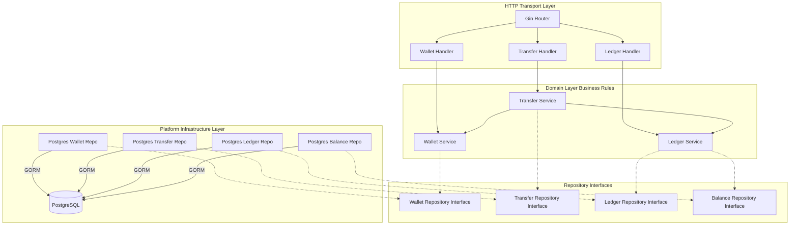

# Wallet Transfer Service

[](https://golang.org)
[](https://postgresql.org)
[](#-architecture--design)

A high-performance, transactional backend service in Go for managing wallets, ledger balances, and processing currency transfers. This service is designed using Domain-Driven Design (DDD) and Clean Architecture principles to guarantee strict transaction safety, concurrency control, and idempotency.

---

## 🏗️ Architecture & Design

The service follows **Clean Architecture** to maintain clean boundaries between high-level business rules and infrastructure details. 



### Key Architectural Pillars

*   **Inward-Pointing Dependencies**: Domain packages define interface contracts (e.g. repositories). Concrete implementations reside in the infrastructure/platform layer.
*   **Double-Entry Bookkeeping**: Transactions are recorded immutably. Every transfer writes a debit and credit entry pair to ensure the ledger balance can always be reconstructed from zero.
*   **Database-Agnostic Transaction Boundaries**: The [ledger.Service](file:///wallet-transfer-assignment/internal/domain/ledger/service.go) coordinates transactions using a clean abstraction [tx.Starter](file:///wallet-transfer-assignment/internal/platform/tx/tx.go), isolating the business layer from database connection objects.
*   **Strict Idempotency**: Double-spend or duplicate transfer requests are prevented at the transfer layer by recording every transaction request state and checking the `txnId` key before execution.
*   **Concurrency Control**: Multiple concurrent transfers to/from the same wallet are synchronized via database row-locking, preventing race conditions.

---

## 📂 Project Structure

Below is an overview of the key components in the repository:

```
wallet-transfer-assignment/
├── server/
│   └── main.go                         # API entrypoint, dependency wiring, and migrations
├── internal/
│   ├── domain/                         # Bounded domain contexts
│   │   ├── wallet/                     # Wallet registration and metadata
│   │   ├── transfer/                   # Transfer orchestration & idempotency machine
│   │   └── ledger/                     # Balances and double-entry ledger database writes
│   └── platform/                       # Cross-cutting platform components
│       ├── postgres/                   # Postgres connection & repository implementations
│       └── tx/                         # Database-agnostic transaction Starter interface
└── tests/                              # Integration & Concurrency test suites
```

### Key Source Code References

*   **Entrypoint**: [server/main.go](file:///wallet-transfer-assignment/server/main.go)
*   **Wallet Models**: [internal/domain/wallet/model.go](file:///wallet-transfer-assignment/internal/domain/wallet/model.go)
*   **Wallet Service**: [internal/domain/wallet/service.go](file:///wallet-transfer-assignment/internal/domain/wallet/service.go)
*   **Transfer Service**: [internal/domain/transfer/service.go](file:///wallet-transfer-assignment/internal/domain/transfer/service.go)
*   **Ledger Service**: [internal/domain/ledger/service.go](file:///wallet-transfer-assignment/internal/domain/ledger/service.go)
*   **Database Connection**: [internal/platform/postgres/connection.go](file:///wallet-transfer-assignment/internal/platform/postgres/connection.go)
*   **Integration Tests**: [tests/integration/concurrency_test.go](file:///wallet-transfer-assignment/tests/integration/concurrency_test.go)

---

## 🔌 API Endpoints

The service exposes the following JSON endpoints:

### 1. Wallets

#### `POST /wallets`
Registers a new wallet for a user.
*   **Request Body**:
    ```json
    {
      "ownerId": "user_123",
      "currency": "USD"
    }
    ```
*   **Success Response (201 Created)**:
    ```json
    {
      "data": {
        "ID": "wallet_54dbd101-7fa8-4447-9759-45e0fbcfdb41",
        "OwnerID": "user_123",
        "Currency": "USD",
        "Status": "ACTIVE",
        "CreatedAt": "2026-06-01T18:00:00Z",
        "UpdatedAt": "2026-06-01T18:00:00Z"
      },
      "error": null,
      "status": 201
    }
    ```

#### `GET /wallet/:id`
Retrieves metadata for a specific wallet by its ID.
*   **Success Response (200 OK)**:
    ```json
    {
      "data": {
        "ID": "wallet_54dbd101-7fa8-4447-9759-45e0fbcfdb41",
        "OwnerID": "user_123",
        "Currency": "USD",
        "Status": "ACTIVE",
        "CreatedAt": "2026-06-01T18:00:00Z",
        "UpdatedAt": "2026-06-01T18:00:00Z"
      },
      "error": null,
      "status": 200
    }
    ```

### 2. Balances

#### `GET /wallet/balance/:walletId`
Fetches the current balance and the last updated timestamp for a given wallet ID.
*   **Success Response (200 OK)**:
    ```json
    {
      "data": {
        "WalletID": "wallet_54dbd101-7fa8-4447-9759-45e0fbcfdb41",
        "Balance": 15000,
        "UpdatedAt": "2026-06-01T18:05:30Z"
      },
      "error": null,
      "status": 200
    }
    ```

### 3. Transfers

#### `POST /transfers`
Executes a fund transfer between two wallets. The `txnId` serves as the idempotency key.
*   **Request Body**:
    ```json
    {
      "txnId": "ae0f5a77-9b2f-4889-be23-5e92be7e174b",
      "fromWalletId": "wallet_54dbd101-7fa8-4447-9759-45e0fbcfdb41",
      "toWalletId": "wallet_7bc19a35-1cf5-4e3a-8671-872f2e5cf73a",
      "amount": 2500
    }
    ```
*   **Success Response (200 OK)**:
    ```json
    {
      "data": {
        "status": "PROCESSED",
        "txnID": "ae0f5a77-9b2f-4889-be23-5e92be7e174b"
      },
      "error": null,
      "status": 200
    }
    ```

#### `POST /transfers/fund`
Faucets funds into a wallet for development/testing purposes. Operates under the hood by creating a transfer from a default system faucet wallet.
*   **Request Body**:
    ```json
    {
      "toWalletId": "wallet_54dbd101-7fa8-4447-9759-45e0fbcfdb41",
      "amount": 50000
    }
    ```
*   **Success Response (200 OK)**:
    ```json
    {
      "data": {
        "status": "PROCESSED",
        "txnID": "fund_b966cf7e-c852-4752-b883-9b9db6253c30"
      },
      "error": null,
      "status": 200
    }
    ```

---

## 🚀 Running the App & Tests

To get started quickly, please refer to our step-by-step [Setup Guide](file:///wallet-transfer-assignment/setup.md).

### Quick Makefile Targets

A [Makefile](file:///wallet-transfer-assignment/Makefile) is provided to automate environment and execution tasks:

| Command | Action |
| :--- | :--- |
| `make up` | Starts the local database container, waits for it to initialize, then runs the API server |
| `make run` | Starts the local API server on the port defined in `.env` |
| `make docker-db` | Starts a PostgreSQL 15 container mapped to port `5435` |
| `make docker-db-stop` | Stops and destroys the local development database container |

| `make test` | Runs all unit and integration tests |
| `make test-unit` | Runs only unit tests (excluding DB testcontainers) |
| `make test-integration` | Runs integration and concurrency safety tests (requires Docker) |

| `make clean` | Wipes build caches and testing history |
